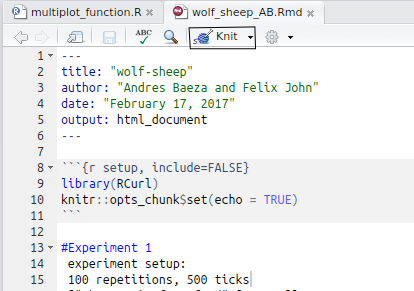

# wolf-sheep
 

ASU ABM club adaptation of the [NetLogo wolf sheep predation model](http://ccl.northwestern.edu/netlogo/models/WolfSheepPredation) with added kill tracking from @mmannin5

## Preparation

Software Requirements: `docker`, `make` and `bash`

1. Install [docker](https://www.docker.com/)
2. Clone this repository
3. Build the Docker images by running `% make build` on the command line in the root of the project. 
4. Prebuilt images can be pulled from [Docker Hub](https://hub.docker.com/r/comses/resbaz-netlogo) (`docker pull comses/resbaz-analysis:3.3.3` and `docker pull comses/resbaz-netlogo:5.3.1`)

## Run the workflow

Executing`% ./run.sh run` on the command line (caveat: only tested on Linux and Mac, it *may* run on Windows 10 bash) will execute the entire pipeline which currently consists of (1) a NetLogo behavior space experiment that generates a single CSV file, and (2) a RMarkdown file that loads the generated CSV file and generates a RMarkdown HTML report. 

The NetLogo data can be found at `data/vary_food_gains.csv` and the resulting RMarkdown report will be produced at `results/wolf_sheep_AB.html`, relative to the root directory. 

## Interact with the workflow

1. Run `make interact`
2. NetLogo GUI should have popped up on your desktop
  - If it hasn't check the logs (`docker-compose logs -f netlogo`). If there is an error about not being able to connect to the X11 server window you need to give docker permission to talk to the X11 socket. This can be done with `xhost +local:docker`.
3. RStudio GUI available at `localhost:8787`

### Interact with NetLogo

The root project directory is mounted at `/code` so the NetLogo model used to generate this model is at `/code/src/wolf-sheep-predation.nlogo`. Open `/code/src/wolf-sheep-predation.nlogo` in NetLogo to view the model. The Behaviour Space settings used the `vary_food_gains` experiment. Parameters for the experiment can be seen by going into *Tools > BehaviourSpace* and opening `vary_food_gains`

### Interact with RStudio

At `localhost:8787` login as rstudio with a password of rstudio. The root project directory (the directory this is in) is mounted into RStudio at `/home/rstudio/code`. It should be visible in the explorer pane in RStudio.

1. Open the `wolf-sheep.Rproj` project file in RStudio (`File > Open Project...` and select `wolf-sheep.Rproj` it will at the path `/home/rstudio/code/wolf-sheep.Rproj`). This will load the Packrat repository used for this project.
2. Open `src/wolf_sheep_AB.Rmd`
3. Run the `knit` command

   

# Notes

This workflow has hard coded the output file generated from NetLogo into a path made accessible to the RMarkdown container. This example uses the hard coded data set name `vary_food_gains.csv`. A more robust workflow would define this type of data in a single place and referencing it in dependent computations so that changing the filename of a dataset does not require manually editing multiple files.

# Packrat Resources

- [Setting up Packrat with an RStudio Project](https://rstudio.github.io/packrat/rstudio.html)
- [Packrat Documentation](https://rstudio.github.io/packrat/)
- [Packrat Video Walthrough](https://www.rstudio.com/resources/webinars/managing-package-dependencies-in-r-with-packrat/)

# References
Wilensky, U. (1997). NetLogo Wolf Sheep Predation model. http://ccl.northwestern.edu/netlogo/models/WolfSheepPredation.
Center for Connected Learning and Computer-Based Modeling, Northwestern University, Evanston, IL.
